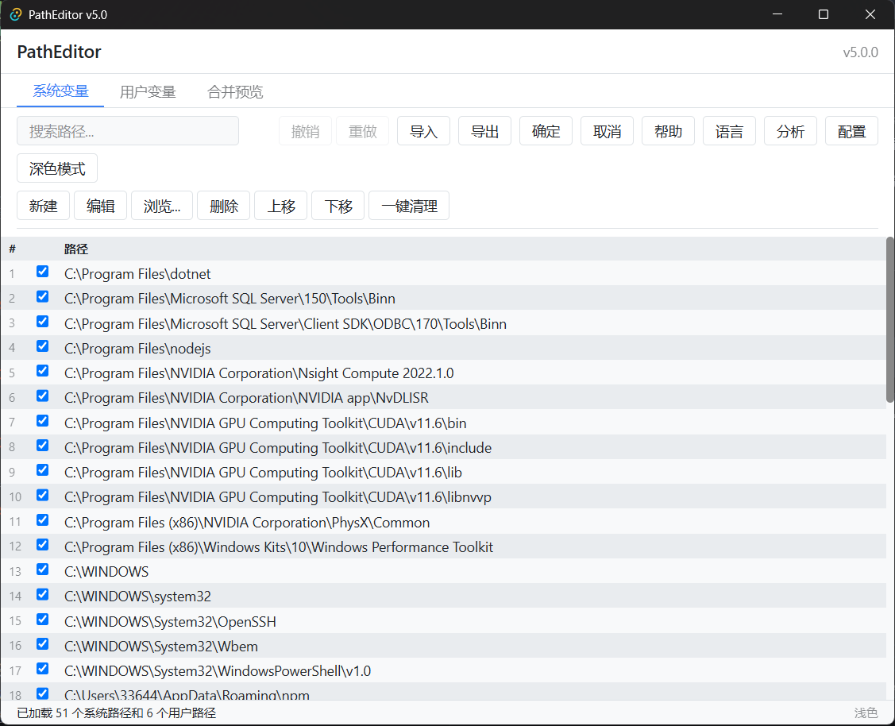
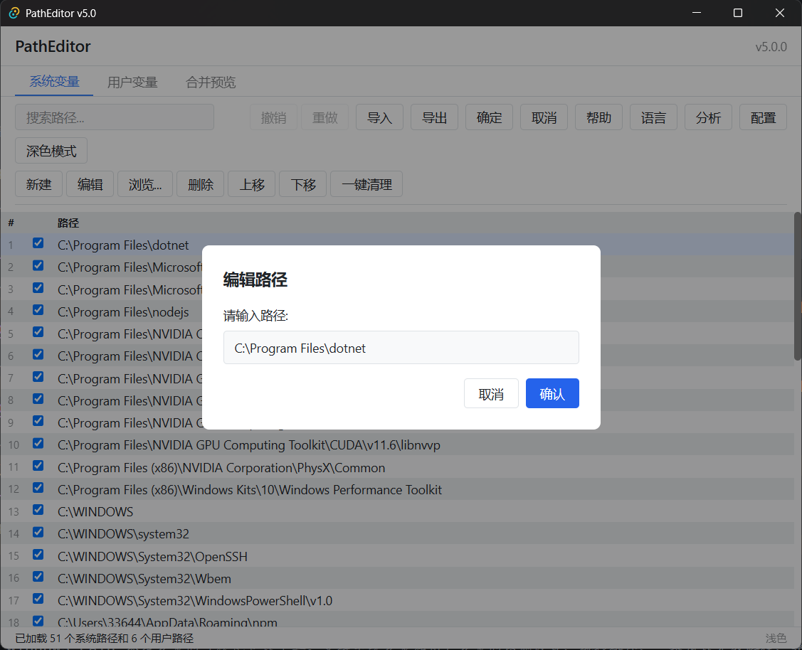
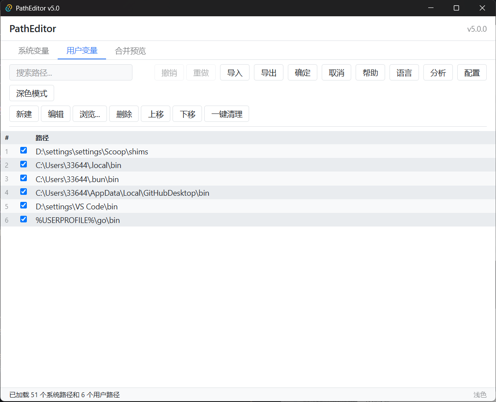
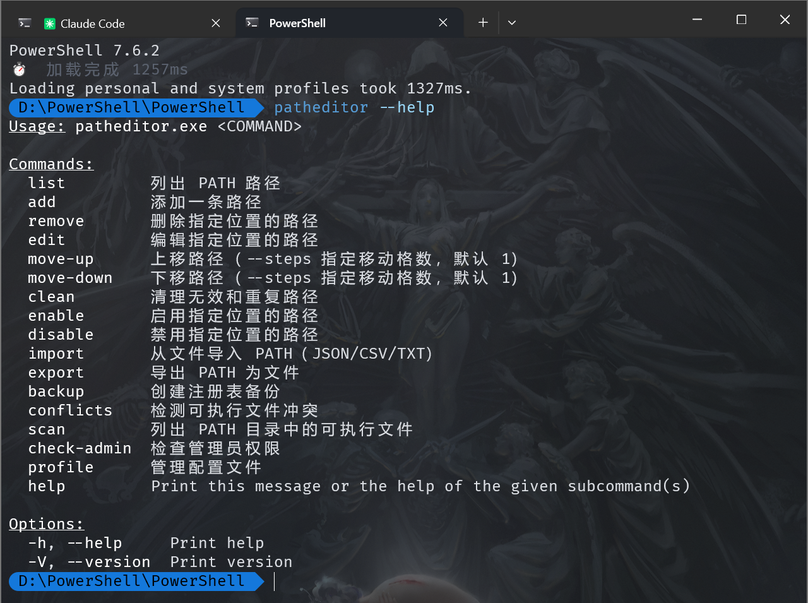
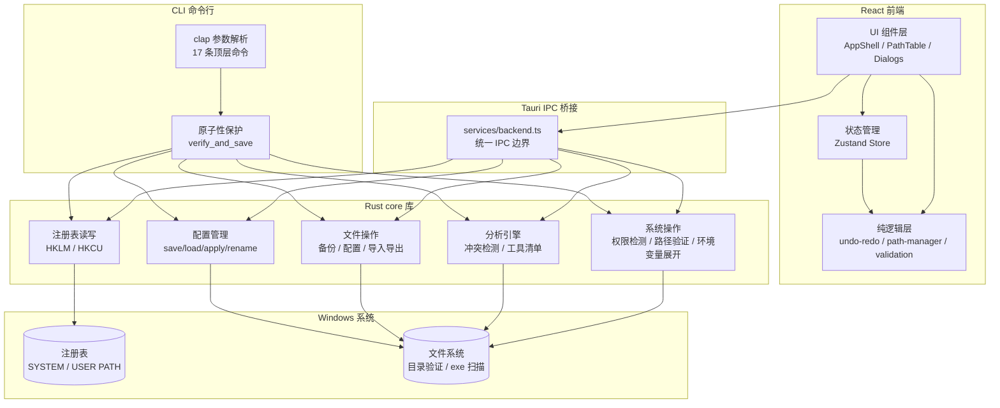
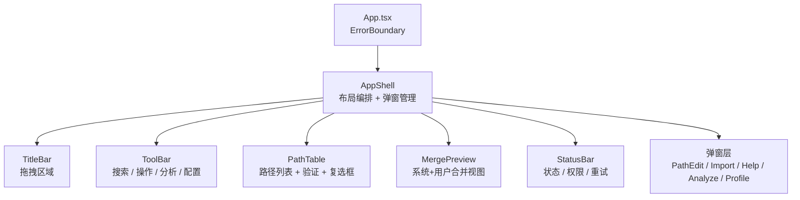
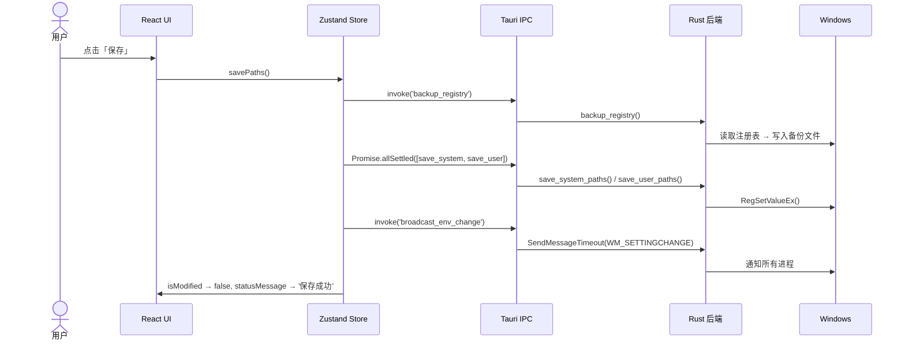
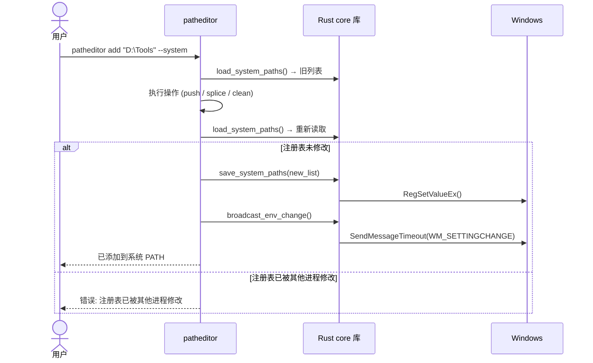

<p align="center">
  <h1>PathEditor</h1>
  <p>Windows 系统环境变量 (PATH) 编辑器</p>
</p>

<p align="center">
  
  
  
  
  
  
  
  <a href="https://codecov.io/gh/LHY0125/PathEditor"></a>
  
</p>

---

## 截图

### 主界面



### 路径编辑



### 冲突检测



### CLI 命令行



---

## 简介

PathEditor 是 Windows PATH 环境变量的可视化管理工具。支持系统变量和用户变量的增删改查、拖拽排序、一键清理无效路径、导入导出以及完整的撤销/重做。

v5.1 使用 **Tauri 2.x + React 19 + TypeScript + Rust**，替代了原有的 C + IUP GUI。

## 架构



### 组件树



### 操作流程



### CLI 操作流程



## CLI 命令行

### 安装

```powershell
scoop bucket add lhy https://github.com/LHY0125/scoop-bucket
scoop install lhy/patheditor-cli
```

或从源码安装：

```bash
cargo install --path cli
```

```bash
# 安装后可直接使用:
patheditor --help

# 查看 PATH
patheditor list --system --json

# 冲突检测
patheditor conflicts

# 配置切换
patheditor profile save "Python开发"
patheditor profile apply "Python开发"

# 通用环境变量（Path 除外）
patheditor env list     [--system|--user] [--json]
patheditor env get      <NAME> [--system]
patheditor env set      <NAME> [--value <V>|--stdin|--value-file <F>] (--revision <R>|--force)
patheditor env add      <NAME> [<VALUE>] [--kind string|expand] [--system]
patheditor env remove   <NAME> (--revision <R>|--force)
```

`remove`、`edit`、`move-up`、`move-down` 默认操作用户 PATH，传入 `--system` 才操作系统 PATH。CLI 的 `list`、`import/export`、`profile`、`enable/disable` 都使用完整快照，避免丢失 `enabled=false` 条目和顺序。

`env` 子命令管理通用环境变量（`Path` 除外，请用 PATH 专用命令）。默认操作用户 hive，加 `--system` 操作系统 hive。

`set` 与 `remove` 必须显式选择并发模式：`--revision <R>`（取自 `env list --json`，外部修改时拒绝写入，退出码 3）或 `--force`（跳过 revision 校验直接覆盖，最后写入者胜，仍受保护名单/类型/权限约束）。敏感值建议用 `--stdin` 或 `--value-file` 传入，避免明文进入 shell 历史与进程列表。

CLI 退出码约定：`0` 成功、`1` 一般错误、`3` revision 冲突（仅 `env set` / `env remove` 且使用 `--revision` 时；PATH 命令恒为 `1`）。`--force` 不携带 revision，不会因并发冲突产生退出码 3。

完整 17 条顶层命令（另有 `env` / `profile` 子命令组）：`patheditor --help`

## 功能

### 路径管理

- 查看和编辑 **系统 PATH**（HKLM）和 **用户 PATH**（HKCU）
- 新建、编辑、删除、上移、下移路径条目
- 多选批量删除
- 实时搜索过滤
- 合并预览（系统 + 用户路径并列显示）
- 文件夹拖拽添加

### 全环境变量管理

- 查看和管理系统 / 用户环境变量项下的**所有变量**（不止 PATH）
- 显示变量的真实注册表类型（`REG_SZ` / `REG_EXPAND_SZ`），不支持的类型只读展示
- 敏感变量（名称含 TOKEN / KEY / SECRET / 密码 / API）默认打码，需显式点击才显示明文
- 系统内置关键变量（`windir`、`ComSpec`、`PATHEXT` 等）硬锁定为只读，防止改坏系统
- `Path` 仍由专用 PATH 视图管理，保证启用/禁用状态与顺序不被绕过

### 路径验证

- **红色**标记：路径在文件系统中不存在
- **橙色**标记：路径在列表中重复出现
- 环境变量路径（含 `%VAR%`）悬浮展开预览

### 撤销/重做

- 支持 9 种操作类型，最多 50 步历史
- 新增、删除、编辑、移动、清理、清空、导入均可撤销

### 导入/导出

- **JSON**：结构化导出，含版本和时间戳
- **CSV**：UTF-8 BOM 编码，兼容 Excel
- **TXT**：纯文本，每行一个路径

### 安全

- 保存前自动备份注册表到 `~/.patheditor/backups/`（文件名含时间戳，如 `path_backup_20260921_200437_062.txt`）
- PATH 长度检查（Windows 单变量上限 32767 字符）
- 非管理员仅系统 PATH 只读，用户 PATH 仍可编辑
- 保存中途失败精确提示哪个注册表 hive 出错
- 禁用路径从注册表移除后仍会以完整快照保留，重启后可恢复显示并重新启用
- 未保存修改时的退出确认使用 Tauri 异步对话框，绝不阻塞界面线程

### 界面

- 深色模式 / 浅色模式
- 中文 / English 界面切换
- 全局键盘快捷键
- 修改状态指示（黄点）+ 未保存退出确认

## 安装

> 本仓库不维护 scoop manifest；两个应用分别在 `LHY0125/scoop-bucket` 中发布。

### 图形界面（GUI）

**方式一：安装包**

从 [Releases](https://github.com/LHY0125/PathEditor/releases) 下载最新版 `PathEditor_5.1.3_x64-setup.exe` 安装。

**方式二：Scoop（免安装）**

```powershell
scoop bucket add lhy https://github.com/LHY0125/scoop-bucket
scoop install lhy/patheditor-gui
```

从 portable zip 解压即用（`PathEditor.exe` + `WebView2Loader.dll`），开始菜单生成 PathEditor 快捷方式。

> **已知问题（v5.1.3）**：GUI 在部分环境下点 X 无响应（窗口 hang），需用任务管理器结束进程。该问题已在 main 修复（关窗确认改为 Tauri 异步对话框 + 补齐窗口销毁权限），待下一版发布。

**方式三：源码构建**

```bash
# 安装依赖
npm install

# 构建安装包
npx tauri build
```

### 命令行（CLI）

**方式一：Scoop**

```powershell
scoop bucket add lhy https://github.com/LHY0125/scoop-bucket
scoop install lhy/patheditor-cli
```

安装后即可在任意终端使用 `patheditor`（CLI 二进制在发布时重命名为 `patheditor-cli_<版本>_x64.exe`，manifest 用 `#/patheditor.exe` 装回原名）。

> **已知问题（v5.1.3）**：该版本发布流程存在产物覆盖缺陷——CLI 与 GUI 共用 Cargo target 目录，而 NTFS 大小写不敏感使 `patheditor.exe` 与 `PathEditor.exe` 实际是同一条目录项，CLI 链接产物覆盖了 GUI 本体。结果是 **`scoop install lhy/patheditor-cli` 装出的可执行文件是 GUI（且无法运行，报 `DLL_NOT_FOUND`）**，不是命令行工具。
>
> 该缺陷已在 main 修复（CLI 改用独立 target 目录构建，`release.yml` 加 `--target-dir target/cli`），**待 v5.1.4 发布后执行 `scoop update patheditor-cli` 即可恢复**。在此之前请改用下面的源码安装方式。

**方式二：从源码安装**

```bash
cargo install --path cli
```

> **要求**：Windows 10+（自带 WebView2），管理员权限才能编辑系统 PATH。

## 开发

```bash
# 开发模式 GUI（热更新）
npx tauri dev

# 仅前端
npm run dev

# 前端测试
npm test

# Rust workspace 检查
cargo check

# CLI 构建
cargo build --release -p patheditor-cli

# 完整构建
npx tauri build
```

### 技术栈

| 层        | 技术                              |
| --------- | --------------------------------- |
| 前端框架  | React 19 + TypeScript (strict)    |
| UI 样式   | Tailwind CSS 4                    |
| 状态管理  | Zustand                           |
| 国际化    | i18next                           |
| 桌面框架  | Tauri 2.x                         |
| 核心库    | Rust workspace (core + gui + cli) |
| 前端测试  | Vitest + Playwright (240 + 24)    |
| Rust 测试 | cargo test (192 个测试)           |
| 构建      | Vite + Cargo                      |
| 打包      | NSIS                              |

### 项目结构

```
core/                         # Rust 核心库（零 Tauri 依赖）
├── error.rs                  # CoreError 结构化错误（code 驱动错误码与前端本地化）
├── service.rs                # 应用服务层（多 hive 事务编排 + 侧车快照）
├── persist.rs                # 持久化原语（schemaVersion / .bak 轮换 / 损坏隔离）
├── registry/                 # 注册表通路（path / access / env_var / conflict 子模块）
├── system.rs                 # 权限检测、路径验证、环境变量展开
├── scanner.rs                # 冲突检测、工具清单
├── profiles.rs               # 配置文件管理
├── backup.rs / disabled.rs   # 备份、禁用状态
└── fs.rs                     # 文件读写、导入导出解析
gui/                          # Tauri 桌面应用（bin 产物 PathEditor.exe）
└── src/commands/             # 薄包装 → 调用 core
cli/                          # 命令行工具（bin 产物 patheditor.exe）
├── src/main.rs               # Clap 定义、CRUD、分派
└── src/                      # runtime / import_export / profile_ops / scan_ops / env_ops
src/                          # React 前端
├── core/                     # 纯逻辑 — 零框架依赖
├── store/                    # Zustand 状态管理
├── services/                 # backend IPC + path session
├── components/               # UI 组件
├── hooks/                    # useAppActions、useKeyboard、usePathValidation
├── i18n/                     # zh-CN / en
└── config/                   # default.json
tests/unit/                   # 前端单元测试
docs/审核和开发/                # 审查与开发记录
```

## 快捷键

| 快捷键   | 功能     |
| -------- | -------- |
| `Ctrl+N` | 新建路径 |
| `Ctrl+S` | 保存     |
| `Ctrl+Z` | 撤销     |
| `Ctrl+Y` | 重做     |
| `Ctrl+F` | 搜索     |
| `Delete` | 删除选中 |
| `F1`     | 帮助     |

## 贡献

欢迎提交 Issue 和 Pull Request。在开始大改动前，建议先开 Issue 讨论。

### 本地开发环境

- Node.js 22+
- Rust 1.95+ (stable-x86_64-pc-windows-gnu)
- MinGW-w64 (GCC 15.x 需配置 `-lmcfgthread` 链接标志)

### 代码规范

- TypeScript `strict: true`，零编译错误
- 所有 Rust `unsafe` 块必须有 `// SAFETY:` 注释
- 前端核心逻辑在 `src/core/`，纯函数，零依赖，可独立测试

## 许可证

MIT License

## 作者

[刘航宇](https://github.com/LHY0125) — 河南理工大学人工智能协会
