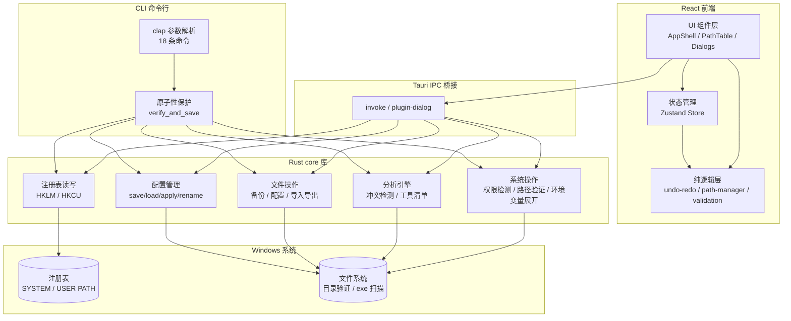
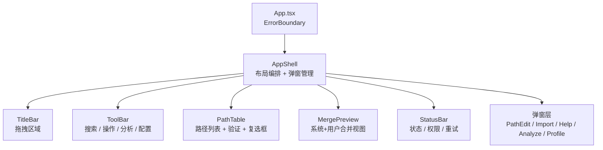
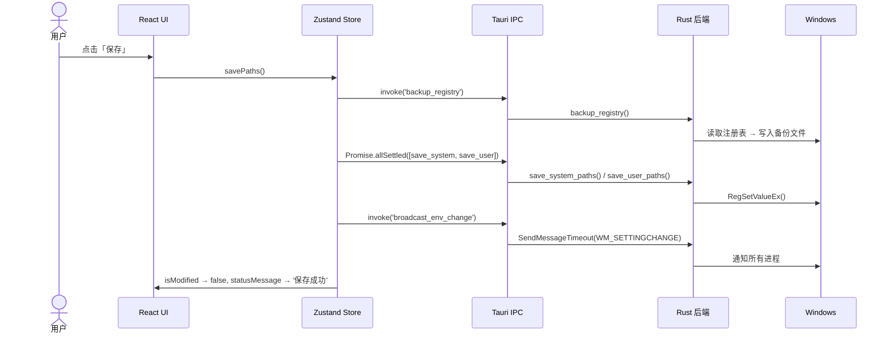
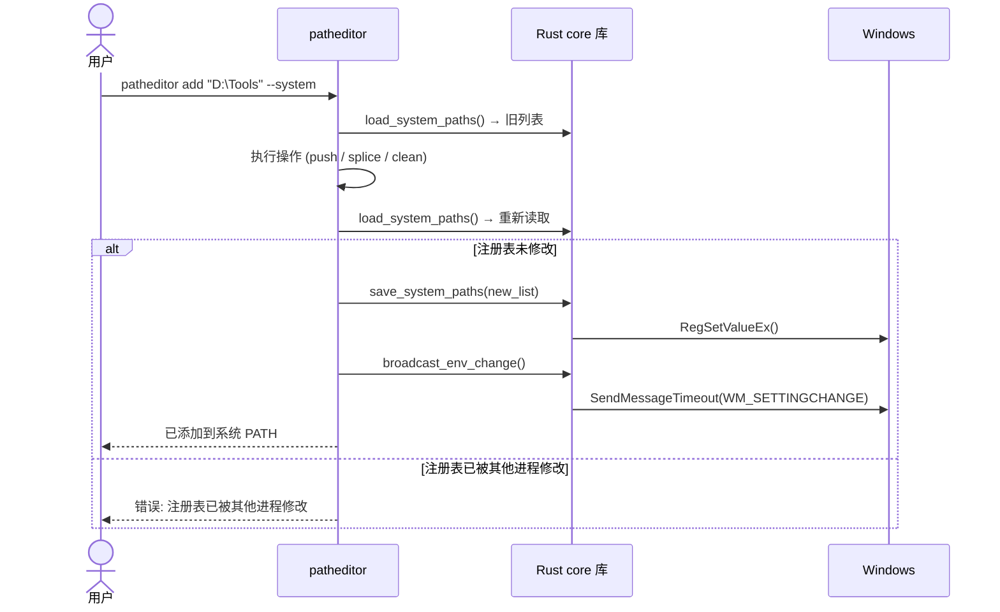

<p align="center">
  <h1>PathEditor</h1>
  <p>Windows 系统环境变量 (PATH) 编辑器</p>
</p>

<p align="center">
  
  
  
  
  
  
  
  
</p>

---

## 简介

PathEditor 是 Windows PATH 环境变量的可视化管理工具。支持系统变量和用户变量的增删改查、拖拽排序、一键清理无效路径、导入导出以及完整的撤销/重做。

v5.0 使用 **Tauri 2.x + React 19 + TypeScript + Rust** 完全重写，替代了原有的 C + IUP GUI。

## 架构



### 组件树



### 操作流程



### CLI 操作流程



## CLI 命令行

```bash
# 安装
cargo install --path cli

# 安装后可直接使用:
patheditor --help

# 查看 PATH
patheditor list --system --json

# 冲突检测
patheditor conflicts

# 配置切换
patheditor profile save "Python开发"
patheditor profile apply "Python开发"
```

完整 18 条命令：`patheditor --help`

## 功能

### 路径管理

- 查看和编辑 **系统 PATH**（HKLM）和 **用户 PATH**（HKCU）
- 新建、编辑、删除、上移、下移路径条目
- 多选批量删除
- 实时搜索过滤
- 合并预览（系统 + 用户路径并列显示）
- 文件夹拖拽添加

### 路径验证

- **红色**标记：路径在文件系统中不存在
- **橙色**标记：路径在列表中重复出现
- 环境变量路径（含 `%VAR%`）悬浮展开预览

### 撤销/重做

- 支持 9 种操作类型，最多 50 步历史
- 新增、删除、编辑、移动、清理、清空、导入均可撤销

### 导入/导出

- **JSON**：结构化导出，含版本和时间戳
- **CSV**：UTF-8 BOM 编码，兼容 Excel
- **TXT**：纯文本，每行一个路径

### 安全

- 保存前自动备份注册表到 `%APPDATA%/PathEditor/backups/`
- PATH 长度检查（Windows 单变量上限 32767 字符）
- 非管理员自动进入**只读模式**
- 保存中途失败精确提示哪个注册表 hive 出错

### 界面

- 深色模式 / 浅色模式
- 中文 / English 界面切换
- 全局键盘快捷键
- 修改状态指示（黄点）+ 未保存退出确认

## 安装

从 [Releases](https://github.com/LHY0125/PathEditor/releases) 下载最新版 `PathEditor_5.0.0_x64-setup.exe` 安装。

或从源码构建：

```bash
# 安装依赖
npm install

# 构建安装包
npx tauri build
```

> **要求**：Windows 10+（自带 WebView2），管理员权限才能编辑系统 PATH。

## 开发

```bash
# 开发模式 GUI（热更新）
npx tauri dev

# 仅前端
npm run dev

# 前端测试
npm test

# Rust workspace 检查
cargo check

# CLI 构建
cargo build --release -p patheditor-cli

# 完整构建
npx tauri build
```

### 技术栈

| 层 | 技术 |
|---|---|
| 前端框架 | React 19 + TypeScript (strict) |
| UI 样式 | Tailwind CSS 4 |
| 状态管理 | Zustand |
| 国际化 | i18next |
| 桌面框架 | Tauri 2.x |
| 核心库 | Rust workspace (core + gui + cli) |
| 前端测试 | Vitest (72 个测试) |
| Rust 测试 | cargo test (10 个测试) |
| 构建 | Vite + Cargo |
| 打包 | NSIS |

### 项目结构

```
core/                         # Rust 核心库（零 Tauri 依赖）
├── registry.rs               # 注册表读写 + 路径清理
├── system.rs                 # 权限检测、路径验证、环境变量展开
├── scanner.rs                # 冲突检测、工具清单
├── profiles.rs               # 配置文件管理
├── backup.rs / disabled.rs   # 备份、禁用状态
└── fs.rs                     # 文件读写、导入导出解析
gui/                          # Tauri 桌面应用
└── src/commands/             # 薄包装 → 调用 core
cli/                          # 命令行工具
└── src/main.rs               # 18 条命令
src/                          # React 前端
├── core/                     # 纯逻辑 — 零框架依赖
├── store/                    # Zustand 状态管理
├── components/               # UI 组件
├── hooks/                    # useAppActions、useKeyboard
├── i18n/                     # zh-CN / en
└── config/                   # default.json
tests/unit/                   # 前端单元测试
```

## 快捷键

| 快捷键 | 功能 |
|--------|------|
| `Ctrl+N` | 新建路径 |
| `Ctrl+S` | 保存 |
| `Ctrl+Z` | 撤销 |
| `Ctrl+Y` | 重做 |
| `Ctrl+F` | 搜索 |
| `Delete` | 删除选中 |
| `F1` | 帮助 |

## 贡献

欢迎提交 Issue 和 Pull Request。在开始大改动前，建议先开 Issue 讨论。

### 本地开发环境

- Node.js 22+
- Rust 1.95+ (stable-x86_64-pc-windows-gnu)
- MinGW-w64 (GCC 15.x 需配置 `-lmcfgthread` 链接标志)

### 代码规范

- TypeScript `strict: true`，零编译错误
- 所有 Rust `unsafe` 块必须有 `// SAFETY:` 注释
- 前端核心逻辑在 `src/core/`，纯函数，零依赖，可独立测试

## 许可证

MIT License

## 作者

[刘航宇](https://github.com/LHY0125) — 河南理工大学人工智能协会
